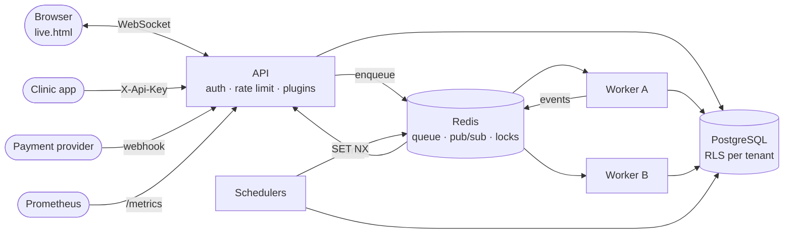
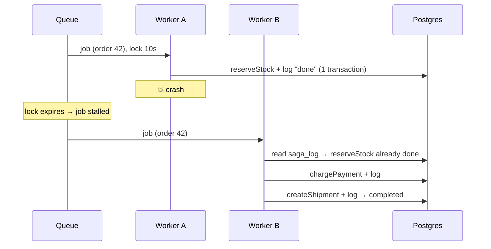

# FlowLite

[](https://github.com/YOUR_USER/flowlite/actions/workflows/ci.yml)

A **multi-tenant workflow engine** that runs business tasks **correctly and exactly once**, even when requests are duplicated, steps fail, workers crash, or many servers run the same schedule.

**100% TypeScript** · Node.js · PostgreSQL (Row-Level Security) · Redis / BullMQ · WebSockets · Prometheus

Runs in two modes from one code base: **`single`** (one process, no Redis, self-hosted) or **`distributed`** (API + workers + schedulers, horizontally scalable).

---

## What it solves

| # | Problem | Technique | Test |
|---|---|---|---|
| 1 | Payment webhook arrives twice | Idempotency key + unique constraint in one transaction | `test:idempotency` |
| 2 | Order fails halfway | Saga with compensations in reverse order | `test:saga` |
| 3 | Worker dies mid-job | Leased jobs + durable step log + atomic steps | `test:crash` |
| 4 | Cron on 3 servers sends 3 emails | Redis `SET NX` lock per schedule slot | `test:cron` |
| 5 | One customer sees / slows another | Postgres RLS + per-tenant rate limit | `test:tenancy` |
| 6 | Extensible workflows | Typed plugin nodes (like n8n nodes), validated before running | `test:plugins` |
| 7 | "Where is my order?" | Live updates over WebSocket, filtered per tenant | `test:live` |
| 8 | Small install without Redis | `MODE=single` + recovery sweep on startup | `test:single` |
| 9 | Rename a column without downtime | Versioned migrations: expand → migrate → contract | `test:migrations` |

Every test **injects the failure** (duplicate requests, crashes, parallel schedulers, cross-tenant access) and checks the result.

---

## Architecture



In **`MODE=single`** the queue, pub/sub, locks and counters are in-memory, and the worker and scheduler run inside the API process. See [RFC 0003](docs/rfc/0003-single-and-distributed-modes.md).

### Crash recovery



---

## Design decisions

Full reasoning in **[docs/rfc](docs/rfc/README.md)**.

- **Atomic check-and-write.** Duplicates are rejected by `INSERT … ON CONFLICT` / unique indexes, never by "SELECT then INSERT".
- **Step work + log row in one transaction**, plus a unique `(order_id, step, status)` index: a step runs at most once, even when two workers race. ([RFC 0001](docs/rfc/0001-durable-saga-execution.md))
- **Tenant isolation in the database**, not only in code: the app user is subject to RLS; a forgotten filter returns nothing instead of leaking data. ([RFC 0002](docs/rfc/0002-multi-tenancy-with-rls.md))
- **Four interfaces** (`JobQueue`, `EventBus`, `Lock`, `Counter`) are the only difference between modes. ([RFC 0003](docs/rfc/0003-single-and-distributed-modes.md))
- **Plugins validate before anything runs**; the HTTP plugin has a host allowlist and refuses redirects (SSRF protection).
- **Zero-downtime schema changes**: a trigger keeps old and new columns in sync while old and new app versions run side by side.

---

## Quick start

**Requirements:** Node.js 20.6+, Docker Desktop.

```bash
docker compose up -d
cp .env.example .env
npm install
npm run migrate
npm start
```

- Health: http://localhost:3000/health
- Live dashboard: http://localhost:3000/live.html

**Distributed mode** (default): also start workers / schedulers in other terminals:
```bash
npm run worker
npm run scheduler
```

**Single mode**: set `MODE=single` in `.env` → `npm start` runs everything. Redis not needed.

## Tests

```bash
npm run typecheck
npm run test:all      # API must be running (MODE=distributed)
```
CI runs the type check and all tests against real Postgres and Redis on every push.

---

## API

Tenant routes need header `X-Api-Key` (demo keys: `demo-key-amina`, `demo-key-berlin`, `demo-key-tiny`).

| Method | Path | Auth | Purpose |
|---|---|---|---|
| `GET` | `/health` | – | Mode, DB and Redis status |
| `GET` | `/metrics` | – | Prometheus metrics |
| `POST` | `/webhooks/payment` | – | Idempotent webhook `{ eventId, orderId, amount }` |
| `GET` | `/payments?eventId=` | – | List payments |
| `GET` | `/tenants/me` | key | Current tenant |
| `GET` | `/inventory` · `/inventory/:sku` | key | Capacity (slots) |
| `POST` | `/orders` | key | Run order saga now `{ sku, qty, amount, simulateFail? }` |
| `POST` | `/orders/async` | key | Queue order `{ …, simulateCrash? }` |
| `GET` | `/orders/:id` | key | Order + step log + charge + delivery |
| `GET` | `/plugins` | key | Available workflow nodes |
| `POST` | `/workflows/run` | key | Run nodes `{ nodes: [{ type, params }], input }` |
| `WS` | `/live?apiKey=` | key | Live order events for your tenant |

Example workflow:
```json
{
  "nodes": [
    { "type": "tbRiskMock", "params": { "threshold": 60 } },
    { "type": "http", "params": { "url": "http://localhost:3000/health" } },
    { "type": "transform", "params": { "pick": ["patientRef", "tbRisk"] } }
  ],
  "input": { "patientRef": "P-001", "opacityScore": 0.9, "coughWeeks": 6 }
}
```
`tbRiskMock` is a **demo formula**, not a medical model.

---

## Observability

| What | Where |
|---|---|
| Structured logs (pino) | stdout, `LOG_FORMAT=pretty` or `json` |
| Request tracing | `X-Request-Id` on every response |
| Metrics | `GET /metrics` |
| Prometheus UI | `docker compose --profile monitoring up -d` → http://localhost:9090 |

Key metrics: `flowlite_http_requests_total`, `flowlite_http_request_duration_seconds`, `flowlite_orders{tenant,status}`, `flowlite_queue_jobs{state}`, `flowlite_rate_limited_total{tenant}`, `flowlite_plugin_runs_total{type,result}`, `flowlite_webhook_events_total{result}`.

---

## Migrations

Versioned SQL files in `migrations/`, applied once each, in order, under an advisory lock.

| File | Phase |
|---|---|
| `001_init.sql` | Schema, RLS policies, app DB user, demo data |
| `002_…_expand.sql` | Add `display_name` + sync trigger (old and new app both work) |
| `003_…_backfill.sql` | Copy old values |
| `004_…_contract.sql` | Drop old column (after all app instances are updated) |

`npm run migrate -- --to=002` stops after a version.

---

## Project structure

```
src/
├── types.ts            contracts: statuses, SagaStep, NodePlugin, JobQueue, EventBus, Lock …
├── config.ts           settings (MODE, URLs)
├── runtime/            memory.ts (single) · redis.ts (distributed) · index.ts (picks one)
├── saga/               runSaga (engine) · orderSteps · processOrder
├── plugins/            registry · runWorkflow · transform · delay · http · tbRiskMock
├── routes/             webhooks · payments · tenants · inventory · orders · workflows
├── tenants.ts          API-key auth + per-tenant rate limit
├── db.ts               pool + withTenant (RLS)
├── live.ts             WebSocket server
├── reports.ts          scheduler + cron lock
├── recovery.ts         single-mode restart recovery
├── metrics.ts · logger.ts
├── server.ts · worker.ts · scheduler.ts · migrate.ts · migrations.ts
migrations/             versioned SQL
scripts/                automated scenario tests
docs/rfc/               design decisions
public/live.html        live dashboard
GUIDE.md                step-by-step learning guide + story
```

## Possible next steps

- Outbox pattern for DB + queue consistency
- OpenTelemetry tracing across API → queue → worker
- Hashed API keys, short-lived WebSocket tokens
- Token-bucket rate limiting

## License

MIT
